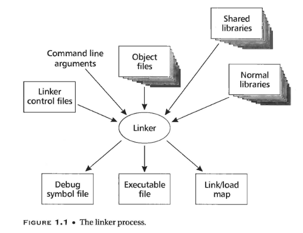

# Linker and Loader

linker or loader最基本的任务就是，**把抽象的名字（人能使用的）绑定到具体实现的名字上（比如地址）**。

比如getline绑定到“可执行程序iosys模块的第612字节上”。

或者把“可执行程序iosys模块的第612字节上” 绑定到一个 具体的地址数字上。

## 地址绑定的历史

回顾一下历史上的编程。
程序员把汇编写在纸上，然后手工转成机器码(assembler‘s work)，再喂给机器。
如果程序员对汇编中地址使用符号进行替代，那么在转换的时候，得对所有使用该符号处进行替换。
如果要增删一行指令，那这个转换可能就得重新进行。

因此，assembler的出现解决了这个问题，assembler允许程序员用符号写汇编，然后自己将符号转换为地址。

如果程序改变，只需要重新跑一下assembler。（任务被交给了assembler)。

而在assembler出现之前就有了 重定位和库搜索 的linker。

因为有代码复用的问题，不可能每个人写全部的代码，肯定有库的出现。

解决办法是这样的：所有库内的子函数在编写的时候都认为自己从地址0开始，将地址绑定延后至子函数要link到main函数时。

在link时，对所有子函数进行重定位，包括main内的call等等。

而**这是没有OS的情况**，每个程序都独享整个机器的内存，汇编后只需要链接到固定的内存地址。

但是有了OS的概念，程序需要和OS以及其他程序共享内存，

这意味着 **程序真正运行的地址只有到了OS把程序load到内存的时候才能确定**。

因此，**最终的地址绑定从之前的link time被延后到了load time**.

这时，linker 和loader开始分工了。

**linker只做部分的地址绑定，给每个subprogram内使用相对地址**。

而**loader则负责最终的重定位步骤，把真正的地址赋值给subprogram**。

而当硬件重定位和虚拟内存的出现，**linker和loader又变得没那么复杂了，因此这时每个程序在逻辑上又独享整个内存了**。
程序可以被load到固定的地址，让硬件来完成Load time的重定位（虚拟地址->物理地址）。

当PC跑同一个程序的多份实例时，可能会想，**代码区是不变的，只有数据对每份实例是独特的**。
OS只需要对不变的部分有一个copy就可以，变的部分有多个copy。
因此，编译器和汇编器做了修改，可以创建多个section，比如一个section是read-only的code，另一个section是writeable data。
这就导致了 Linker得把不同section给结合起来，这样链接好的程序可以把Code放在一个地方，Data放在另一个地方。
linker这时得给所有的sections都分配地址。

尽管一个PC上跑了不同的程序，但这些程序可能比如都使用libc，**这种共享库在内存中就只需要一份**。节省了内存空间。

static share library当库build时，就被绑定到特定的地址了，linker会在链接时绑定程序对此库的引用的地址。(比如call)。
静态库成了程序的一部分，这意味着不够灵活，每次库升级，整个程序都得重新链接。
dynamic shared libraray的出现，表示库内的 sections和symbol只有当使用此库的程序运行的时候，才会被绑定到实际的地址。
甚至可以延迟到，只有当程序用到此库内的东西时，比如第一次call，才会对call的procedure做地址绑定。
更进一步，程序可以运行过程中动态加载此库，这就增加了程序的扩展能力。

## linker和loader的区别

linker和loader有如下任务

1.Program loading:把程序从硬盘（或其他第二存储）加载到内存，让他可以跑。有时只是单纯的复制，有时也包括分配空间，设置Protection bits，安排虚拟内存映射虚拟地址到磁盘page。

2.Relocation:**编译器和汇编器只会产生程序地址从0开始的object code**.(虽然很少有PC会让你在0加载内存0)。如果一个程序由多个子程序组成，所有其他的子程序都必须在不重叠的内存处加载自己。**重定位就是1.把加载地址分配到程序的不同部分，2.调整这些原有指令和数据中的地址值，和加载后的地址匹配**。
linker组织多个子程序的不同位置（重定位的第一个任务），然后创建出一个大的从地址0开始的链接好的程序linked program。
当程序加载时，由OS来选择加载地址，已经链接好的一整个程序会被重定位到加载好的地址。（重定位的第二个任务）

3.Symbol Resolution:要组成一个程序的 多个子程序间，是使用符号来引用的。比如main中使用了sqrt，linker解析此符号时会去找sqrt在哪个库中，然后将调用者(main)的object code给patch一下，就是将地址替换成sqrt所在的真正地址。

linking和loading的工作存在相当的重合，但是还是按规矩如下定义：

**做program loading的是loader**
**做Symbol Resolution的是linker**
**Relocation二者都可以做，甚至有三合一全做的linking loaders.**

重定位和符号解析的界限比较模糊，因为linkers本身就可以解析对符号的引用，那么对于代码重定位就有个办法是，对每个子程序的base address都分配一个符号，然后把可重定位的地址当作对基地址符号的引用，这样linker就能解决代码重定位的问题。

**linker和loader的一个共同特性就是都会对object code做patch**。

## linking - two pass process

linking的基本流程，如同汇编和编译 有两趟。

一个linker接受 多个object files, libraries,command files等等然后最终产生一个单独的object file，也可能附加一些比如load map和debug的符号文件。

每个input files都含有多个segments，多个连续的代码段或者数据段，会放到output file中。
每个input files至少包含一个符号表。
有些符号导出，给其他文件调用。有些符号导入，从其他地方调用代码。

第一趟扫描：
1.扫描Input files中segments的大小，建立一张segment table，列出所有Input files中定义的segments.
2.收集所有符号的定义和引用，建立一张符号表，包括所有导入和导出的符号。
3.使用上面收集到的数据，linker给所有的符号分配数字地址，对于ouput的地址空间决定所有segments的位置和size，并决定output file中所有东西的位置。

第二趟扫描：
1.使用第一躺扫描中的结果来控制实际的linking process。